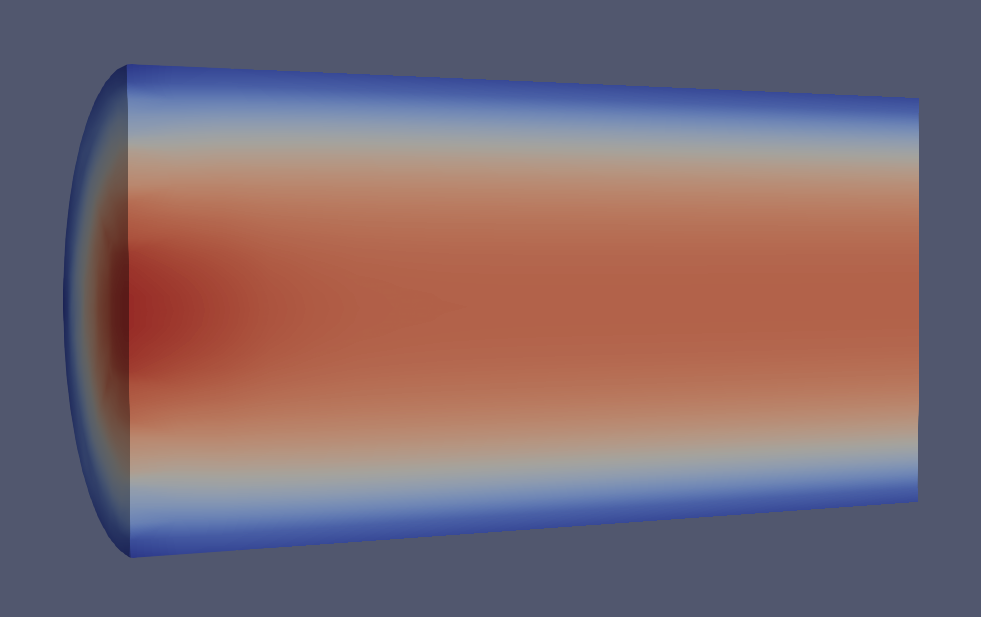

# 1D-3D Pipe Simulation

This repository is the result of the Partitioned Fluid Structure Interaction and Multiphysics Simulation Seminar at TUM in WiSe 2021/22.
The code provided allows to simulate a partitioned 1D-3D geometric multi-scale model of pipe flow.




Author: Elia Zonta (elia.zonta@tum.de)

Advisor: Gerasimos Chourdakis

The accompanying [seminar paper](paper.pdf) and [seminar presentation](seminar_presentation.pdf) can also be found in this repository.

## Requirements

OpenFOAM, preCICE

## How to run

In two different terminals run:

```bash
cd Fluid1D && ./euler_eq.py
```

```bash
cd Fluid3D && ./run.sh
```
